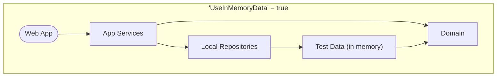
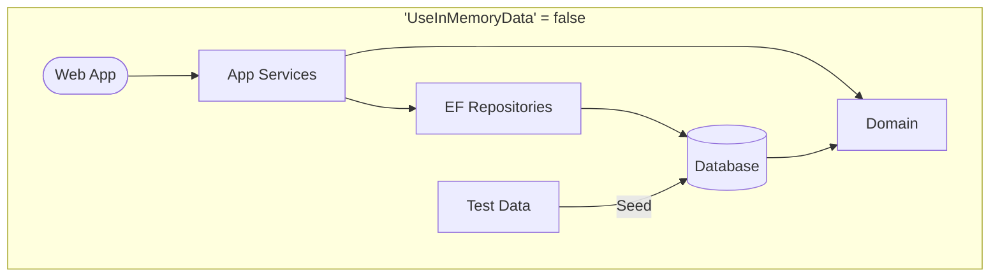
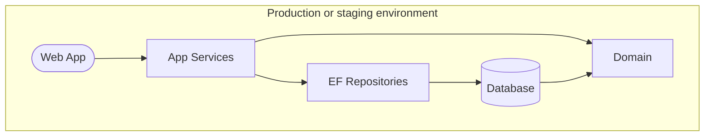

# Template Application

This repository contains a template for use in creating new web applications.

[](https://github.com/gaepdit/template-app/actions/workflows/dotnet-test.yml)
[](https://github.com/gaepdit/template-app/actions/workflows/codeql-analysis.yml)
[](https://sonarcloud.io/summary/new_code?id=gaepdit_template-app)
[](https://sonarcloud.io/summary/new_code?id=gaepdit_template-app)

*[The SonarCloud badges require a SonarCloud project to be configured.]*

---

## Template setup and use

The following steps describe how to use the template for a new application.

### Initialize the template files

* Run the "create-sln.ps1" file to create a new solution file.
* Rename or search and replace the following terms. *(Caution: not all of these will be visible in the Visual Studio solution view.)*
    - "MY_APP_NAME" - Replace with the readable display name of the app.
    - `MyAppRoot`:
        - Rename the root namespace for the app.
        - Update the `<RootNamespace>` element in each "csproj" file.
        - Update the namespace in the "_ViewImports.cshtml" file.
        - Update the exclusions in the coverlet commands in the "sonarcloud-scan.yml" file.
        - Update the exclusions in the "finecodecoverage-settings.xml" file.
    - "template-app" - Search and replace with the repository name. This will affect the following:
        - The LocalDB database name in various connection strings.
        - The project key in the "sonarcloud-scan.yml" workflow file.
        - The comment URL path in the "lighthouse-analysis.yml" workflow file.
        - The URLs in the GitHub and SonarCloud badges above.

### Customize the application

* Update this README file with information about the new application.
* Change the branding colors in "src\WebApp\wwwroot\css\site.css".

---

## Background and project requirements

TODO: Complete this section for each new application.

---

## Info for developers

This is an ASP.NET 6 web application.

### Prerequisites for development

+ [Visual Studio](https://www.visualstudio.com/vs/) or similar
+ [.NET 6.0 SDK](https://dotnet.microsoft.com/download)

### Preparing for deployment

Complete the following tasks when the application is ready for deployment.

* Create server-specific settings and config files and add copies to the "app-config" repository.
* Create Web Deploy Publish Profiles for each web server using the "Example-Server.pubxml" file as an example.
* Configure the following external services as needed:
    - [Azure App registration](https://portal.azure.com/#view/Microsoft_AAD_RegisteredApps/ApplicationsListBlade) to manage employee authentication. *(Add configuration settings in the "AzureAd" section in a server settings file.)*
      When configuring the app in the Azure Portal, add optional claims for "email", "family_name", and "given_name" under "Token configuration".
    - [Raygun](https://app.raygun.com/) for crash reporting and performance monitoring. *(Add the API key to the "RaygunSettings" section in a server settings file.)*
    - [SonarCloud](https://sonarcloud.io/projects) for code quality and security scanning. *(Update the project key in the "sonarcloud-scan.yml" workflow file and in the badges above.)*
    - [Better Uptime](https://betterstack.com/better-uptime) for site uptime monitoring. *(No app configuration needed.)*

### Project organization

The solution contains the following projects:

* **Domain** — A class library containing the data models, business logic, and repository interfaces.
* **AppServices** — A class library containing the services used by an application to interact with the domain.
* **LocalRepository** — A class library implementing the repositories and data stores using static in-memory test data (for local development).
* **EfRepository** — A class library implementing the repositories and data stores using Entity Framework and a database (as specified by the configured connection string).
* **WebApp** — The front end web application and/or API.

There are also corresponding unit test projects for each, plus a **TestData** project containing test data for development and testing.

### Development settings

The following development settings configure the data stores and authentication. To change these settings, add an "appsettings.Development.json" file in the root of the "WebApp" folder with a `DevSettings` section. (Optionally, the settings file can also include an `AzureAd` section or database connection string as needed.)

- *UseInMemoryData* — 
    - When `true`, the `LocalRepository` project is used for repositories and data stores. Data is initially populated from the `TestData` project. 
    - When `false`, the `EfRepository` project is used, and a SQL Server database (as specified by the connection string) is seeded from the `TestData` project. <small>(If the connection string is missing, then a temporary EF Core in-memory database provider is used. This option is included for convenience and is not recommended.)</small>
- *UseEfMigrations* — Uses Entity Framework migrations when `true`. When `false`, the database is deleted and recreated on each run. (Only applies if *UseInMemoryData* is `false`.)
- *UseAzureAd* — If `true`, connects to Azure AD for user authentication. (The app must be registered in the Azure portal, and configuration added to the settings file.) If `false`, authentication is simulated using test user data.
- *LocalUserIsAuthenticated* — Simulates a successful login with a test account when `true`. Simulates a failed login when `false`. (Only applies if *UseAzureAd* is `false`.)
- *LocalUserIsAdmin* — Adds all App Roles to the logged in account when `true` or no roles when `false`. (Applies whether *UserAzureAd* is `true` or `false`.)

When running in the production environment, the settings are automatically set as follows:

```csharp
UseInMemoryData = false,
UseEfMigrations = true,
UseAzureAd = true,
LocalUserIsAuthenticated = false,
LocalUserIsAdmin = false,
```

Here's a visualization of how the settings configure data storage at runtime.







### Entity Framework database migrations

Instructions for adding a new Entity Framework database migration:

1. Open a command prompt to "./src/EfRepository/" folder.

2. Run the following command with an appropriate migration name:

   `dotnet ef migrations add NAME_OF_MIGRATION --msbuildprojectextensionspath ..\..\.artifacts\EfRepository\obj\`
