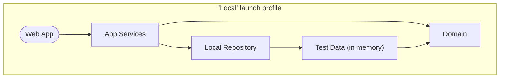
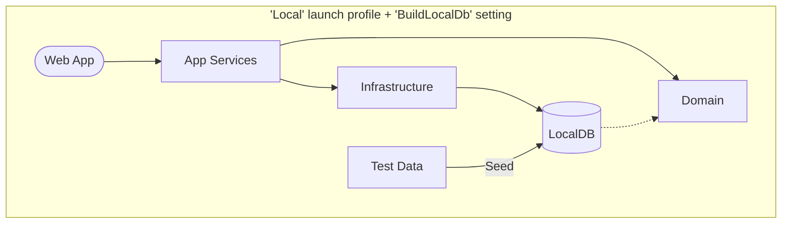
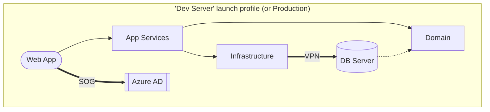

# Template Application

This repository contains a template for use in creating new web applications.

*[The SonarCloud badges require a SonarCloud project to be configured.]*

---

## Template use and setup

Do the following steps to customize the app:

* Update this README file with details on the new application.

* Rename the solution file from "template-app.sln".

* Rename or search and replace the following terms:

    - *MY_APP_NAME* - Search and replace with the readable display name of the app.
    - `MyAppRoot`:
        - Rename the root namespace for the app.
        - Update the `<RootNamespace>` element in each csproj file.
        - Update the namespace in the "_ViewImports.cshtml" file.
        - Update the exclusions in the coverlet commands in the "sonarcloud-scan.yml" file.
        - Update the exclusions in the "finecodecoverage-settings.xml" file.
    - "template-app" - Search and replace with the repository name. This will affect the following:
        - The LocalDB database name in the "appsettings.json" and "AppDbContextFactory" files.
        - The project key in the "sonarcloud-scan.yml" workflow file.
        - The URLs in the GitHub and SonarCloud badges above.

* Update the "docs/Site map.md" file.

* Change branding colors in "src\WebApp\wwwroot\css\site.css".

* Make copies of the settings and config files in the "app-config" repository and update with correct values.

* Create new Web Deploy Publish Profiles for each web server using the "Example-Server.pubxml" file as an example.

## External services

The following external services can be configured for new applications:

* [Azure App registration](https://portal.azure.com/#view/Microsoft_AAD_RegisteredApps/ApplicationsListBlade) to manage employee authentication. *(Add configuration settings in the "AzureAd" section in a server settings file.)*
* [Raygun](https://app.raygun.com/) for crash reporting and performance monitoring. *(Add the API key to the "RaygunSettings" section in a server settings file.)*
* [SonarCloud](https://sonarcloud.io/projects) for code quality and security scanning. *(Update the project key in the "sonarcloud-scan.yml" workflow file and in the badges above.)*
* [Better Uptime](https://betterstack.com/better-uptime) for site uptime monitoring. *(No app configuration needed.)*

---

## Background and project requirements

TODO

## Info for developers

This is an ASP.NET 6 web application.

### Prerequisites for development

+ [Visual Studio](https://www.visualstudio.com/vs/) or similar
+ [.NET 6.0 SDK](https://dotnet.microsoft.com/download)

### Project organization

The solution contains the following projects:

* **Domain** — A class library containing the data models and business logic.
* **AppServices** — A class library containing the services used by an application to interact with the domain.
* **LocalRepository** — A class library implementing the repository and services without using a database (for local development).
* **Infrastructure** — A class library implementing the repository and services using Entity Framework (for server deployment).
* **WebApp** — The front end web application.

There are also corresponding unit test projects for each, plus a **TestData** project containing test data for development and testing.

### Launch profiles

There are two launch profiles:

* **WebApp Local** — This profile uses data in the "TestData" project and does not connect to any external server. A local user account is used to simulate authentication.

    You can modify some development settings by creating an "appsettings.Local.json" file in the "WebApp" folder to test various scenarios:

    - *AuthenticatedUser* — Simulates a successful login with a test account when `true`. Simulates a failed login when `false`.
    - *AuthenticatedUserIsAdmin* — Applies all App Roles to the logged in account when `true` or no roles when `false`. (Only applies if *AuthenticatedUser* is `true`.)
    - *BuildLocalDb* — Uses LocalDB when `true`. Uses in-memory data when `false`.
    - *UseEfMigrations* - Uses Entity Framework migrations when `true`. Deletes and recreates database when `false`. (Only applies if *BuildLocalDb* is `true`.)

* **WebApp Dev Server** — This profile connects to a remote database server for data and requires an SOG account to log in. *To use this profile, you must add the "appsettings.Development.json" file from the "app-config" repo.*

    Most development should be done using the Local profile. The Dev Server profile is only needed when specifically troubleshooting issues with the database server or SOG account.

Here's a visualization of how each launch profile (plus the `BuildLocalDb` setting) configures the application at runtime.

