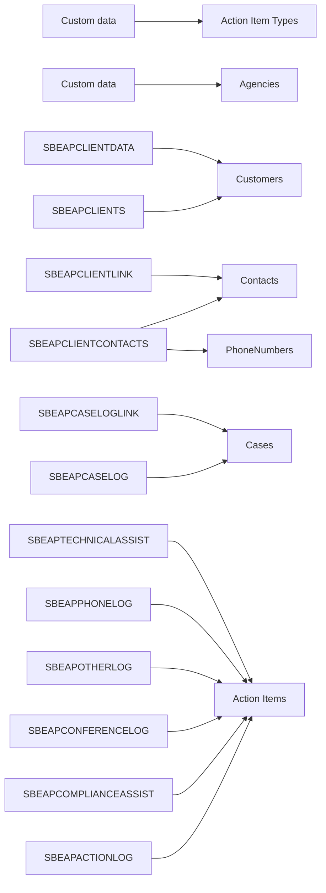

# Data migration flow

```mermaid
flowchart LR

    C[Custom data] --> T[Action Item Types]

    D[Custom data] --> G[Agencies]

    SBEAPCLIENTS --> U[Customers]
    SBEAPCLIENTDATA --> U

    AO[SBEAPCLIENTCONTACTS] --> O[Contacts]
    SBEAPCLIENTLINK --> O

    AO --> P[PhoneNumbers]

    SBEAPCASELOG --> S[Cases]
    SBEAPCASELOGLINK --> S

    SBEAPACTIONLOG --> A[Action Items]
    SBEAPCOMPLIANCEASSIST --> A
    SBEAPCONFERENCELOG --> A
    SBEAPOTHERLOG --> A
    SBEAPPHONELOG --> A
    SBEAPTECHNICALASSIST --> A

```
