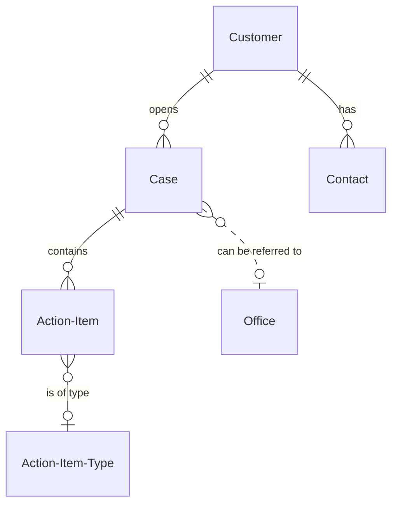

# Entity relationship diagram

```mermaid
erDiagram

Customer    ||--o{ Case             : "opens"
Case        ||--o{ Action-Item      : "contains"
Customer    ||--o{ Contact          : "has"
Case        }o..o| Office           : "can be referred to"
Action-Item }o--o| Action-Item-Type : "is of type"
```
