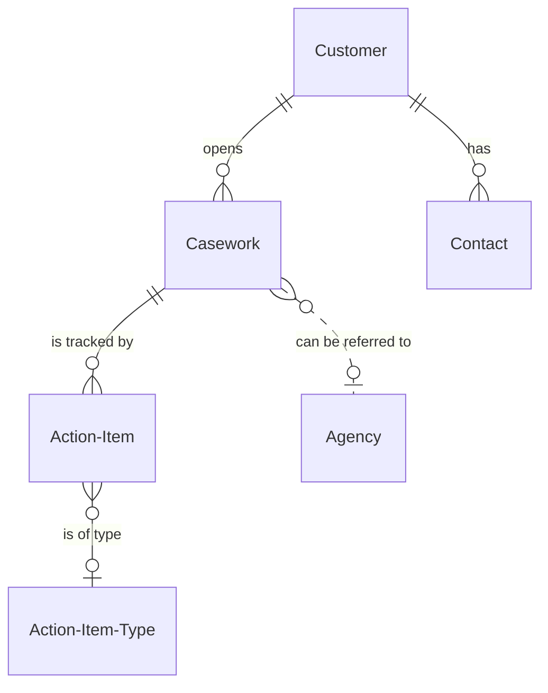

# Entity relationship diagram

```mermaid
erDiagram

Customer    ||--o{ Casework         : "opens"
Casework    ||--o{ Action-Item      : "is tracked by"
Customer    ||--o{ Contact          : "has"
Casework    }o..o| Agency           : "can be referred to"
Action-Item }o--o| Action-Item-Type : "is of type"
```
